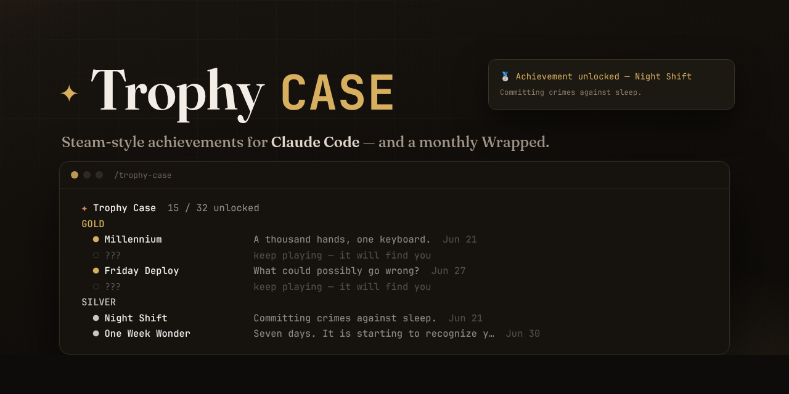
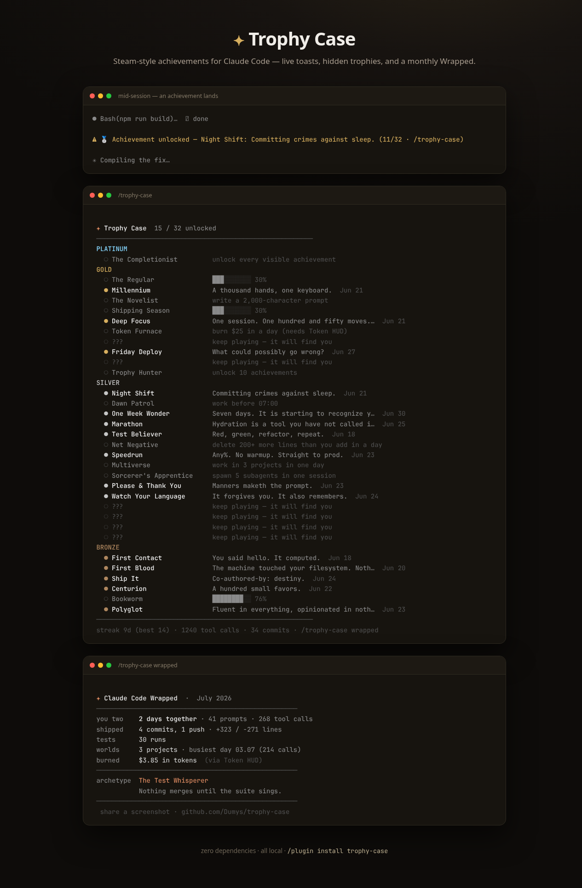

**Steam-style achievements for [Claude Code](https://code.claude.com)** — live
*Achievement unlocked* toasts while you work, a trophy shelf in your terminal,
hidden trophies, and a monthly **Wrapped** with your coding archetype.
One file, zero dependencies, everything stays on your machine.

## What you get

- **32 achievements** across bronze → platinum: from *First Blood* (your first
  tool call) to *Millennium* (1,000 of them), *Night Shift*, *Friday Deploy*,
  *Speedrun*, *Net Negative*…
- **Hidden trophies** you can only find by behaving in ways we will not
  disclose here. Politeness counts. So does the opposite.
- **Live toasts** — unlocks appear right in the Claude Code UI mid-session,
  via hooks. No polling, no daemon.
- **`/trophy-case wrapped`** — a monthly recap: days together, commits,
  night sessions, busiest day, and your archetype (*The Night Surgeon*,
  *The Test Whisperer*, *The Demolitionist*…). Built to be screenshotted.
- **Works with [Token HUD](https://github.com/Dumys/token-hud)** — if it is
  installed, Wrapped shows your token spend, and the *Token Furnace*
  achievement becomes earnable.



## Install

**As a plugin** (inside Claude Code) — hooks activate automatically:

```
/plugin marketplace add Dumys/trophy-case
/plugin install trophy-case@trophy-case
```

**Or standalone:**

```bash
git clone https://github.com/Dumys/trophy-case.git
cd trophy-case && node ach/trophy.js --install
```

New sessions start earning immediately. Check your shelf with
`/trophy-case`, or run `node ach/trophy.js --cabinet` from anywhere.

**Requires:** Node.js ≥ 16, Claude Code ≥ 2.0.

## How it works

Claude Code fires [hooks](https://code.claude.com/docs/en/hooks) on session
events — tool calls, prompts, subagents, permission denials, compactions.
Trophy Case listens (≈70 ms per event, non-blocking), keeps counters in
`~/.claude/trophy-case/`, and when a predicate flips, prints a `systemMessage`
that Claude Code shows as a toast:

```
⚠ 🥈 Achievement unlocked — Night Shift: Committing crimes against sleep. (11/32 · /trophy-case)
```

- All tracking is **local**. Nothing is uploaded, ever.
- Prompts are scanned only by regex for a few fun counters (politeness…);
  prompt text is never stored.
- Uninstall any time: `node ach/trophy.js --uninstall` (trophies are kept).

## FAQ

**Can I see the hidden achievements?** No. That is the point. (Fine — they are
in the source. But where is your honor?)

**Does it slow Claude down?** Hooks add ~70 ms after a tool call completes,
which is invisible next to model latency.

**Multiple machines?** State is per-machine for now. Your streak knows what
you did on your laptop; your desktop does not.

## License

MIT
